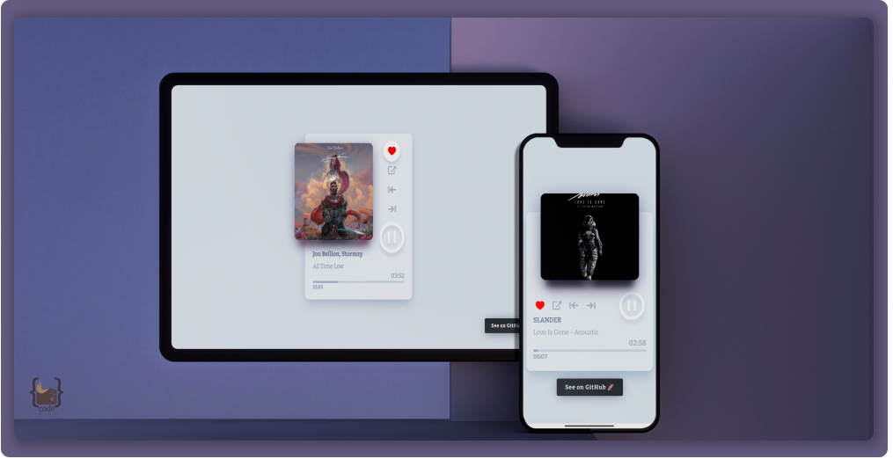

<h1 align="center">
   
  
   
  Mini music player
   
</h1>

<h4 align="center">This is a simple static mini music player build in basics of HTML, CSS and JS. Used Vue.js as library for javascript. </h4>

  <a href="#🛠-overview">Overview</a> •
  <a href="#🚀-built-with">Build with</a> •
  <a href="#👉🏼-links">Live links</a> •

<h5 align="center">Don't forget to give a ⭐️ </h5>

## 🛠 Overview

- Fully responsive
- Static app
- Based on Vue.js CDN.
- More than 100s of coding files.
- Covered over 8+ demo songs
- Stunning UI

## 🚀 Built with

- [![Html5][Html5]][Html5-url] [![CSS3][CSS3]][CSS3-url] [![javascript][javascript]][javascript-url]

## 👉🏼 Links

- ⭐️ LIVE LINK : [CODEPEN](https://codepen.io/hafizmp/pen/JjLQYqm)

[Html5]: https://img.shields.io/badge/HTML5-CFD2CF?style=for-the-badge&logo=html5&logoColor=EB1D36
[Html5-url]: https://developer.mozilla.org/en-US/docs/Glossary/HTML5

[CSS3]: https://img.shields.io/badge/CSS3-293462?style=for-the-badge&logo=css3&logoColor=E7F6F2
[CSS3-url]: https://developer.mozilla.org/en-US/docs/Web/CSS

[javascript]: https://img.shields.io/badge/JAVASCRIPT-04293A?style=for-the-badge&logo=javascript&logoColor=FFF80A
[javascript-url]: https://developer.mozilla.org/en-US/docs/Web/javascript